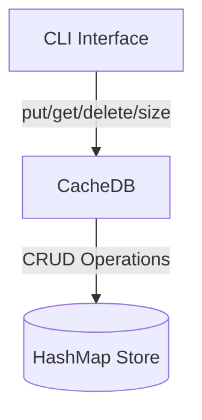
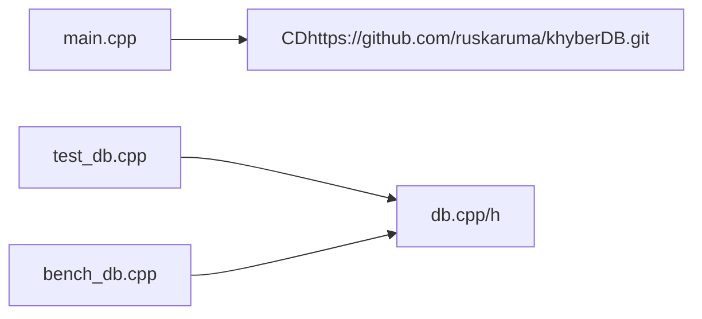
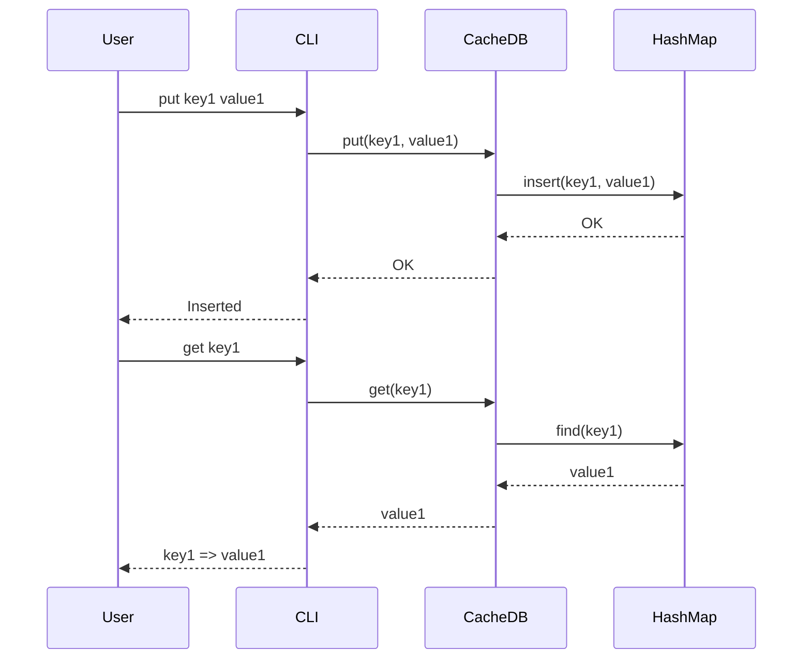
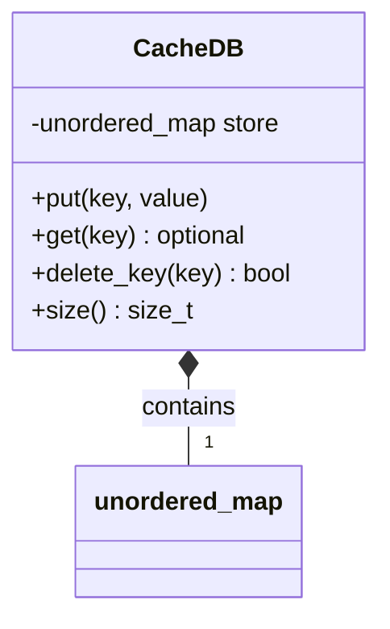

# Architecture

## System Overview

```mermaid
graph TB
    CLI[CLI Interface]
    DB[CacheDB]
    STORE[(HashMap Store)]
    
    CLI -->|put/get/delete/size| DB
    DB -->|CRUD Operations| STORE
```

## Module Structure

```mermaid
graph LR
    CM[main.cpp]
    CD[db.cpp/h]
    CC[test_db.cpp]
    CB[bench_db.cpp]
    
    CM --> CDhttps://github.com/ruskaruma/khyberDB.git
    CC --> CD
    CB --> CD
```

## Data Flow

```mermaid
sequenceDiagram
    participant User
    participant CLI
    participant CacheDB
    participant HashMap
    
    User->>CLI: put key1 value1
    CLI->>CacheDB: put(key1, value1)
    CacheDB->>HashMap: insert(key1, value1)
    HashMap-->>CacheDB: OK
    CacheDB-->>CLI: OK
    CLI-->>User: Inserted
    
    User->>CLI: get key1
    CLI->>CacheDB: get(key1)
    CacheDB->>HashMap: find(key1)
    HashMap-->>CacheDB: value1
    CacheDB-->>CLI: value1
    CLI-->>User: key1 => value1
```

## Class Diagram

```mermaid
classDiagram
    class CacheDB {
        -unordered_map store
        +put(key, value)
        +get(key) optional
        +delete_key(key) bool
        +size() size_t
    }
    
    CacheDB *-- "1" unordered_map : contains
```

